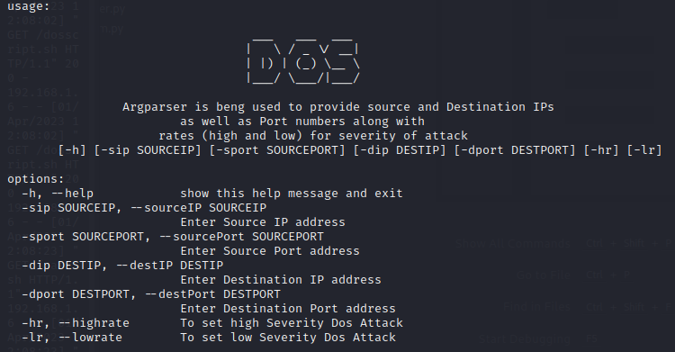
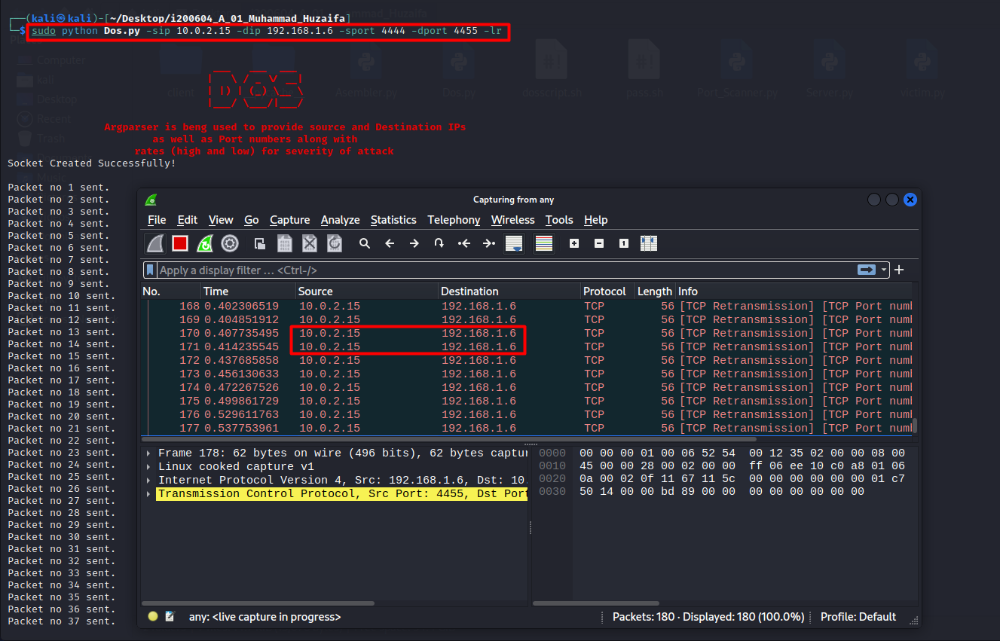
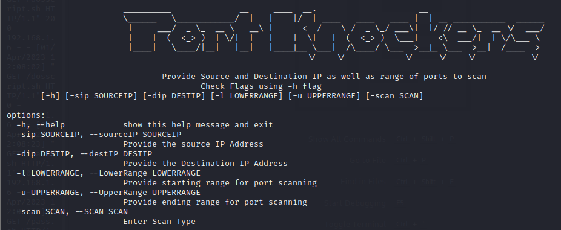
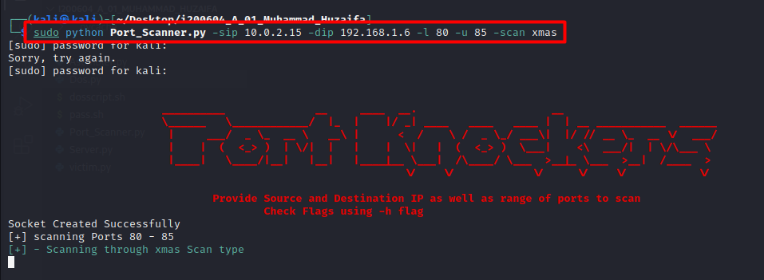
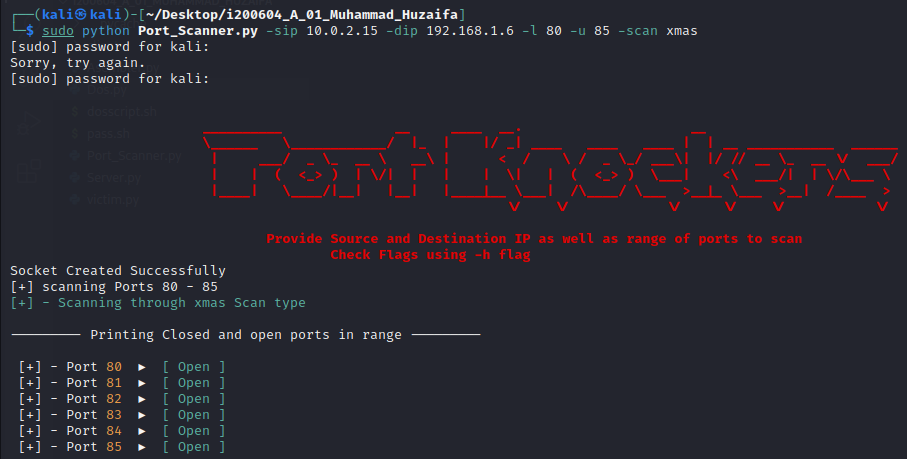
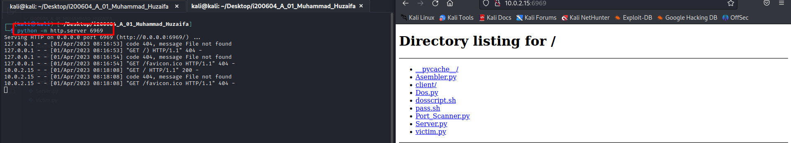
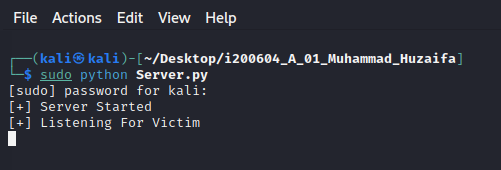
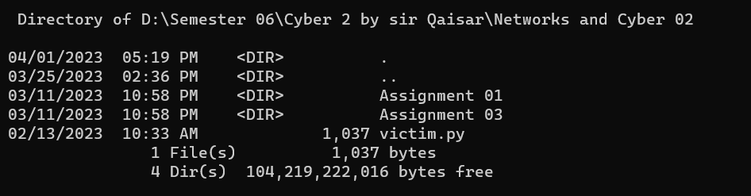
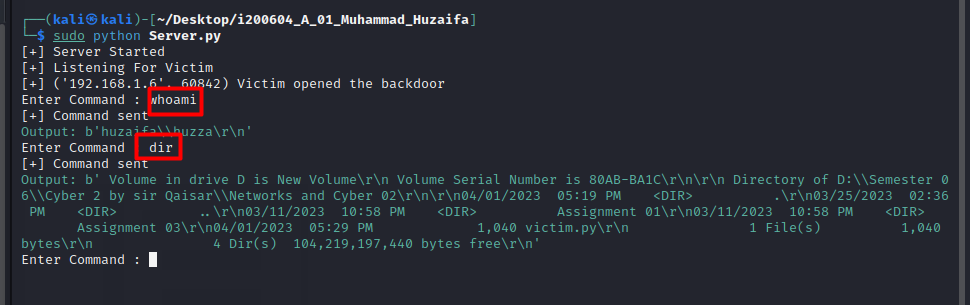
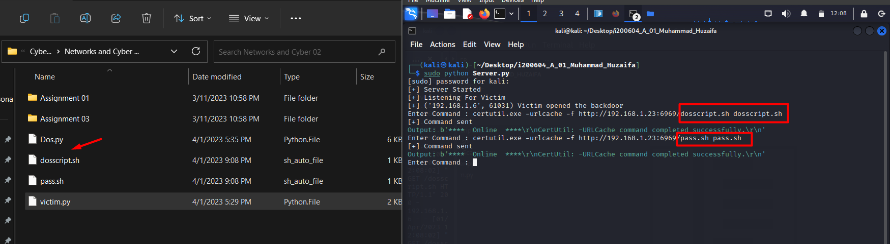

# Port-Knocker
A python script to automate DOS, Port Scanning and Reverse Shell Creation.
* *Author - Muhammad Huzaifa.*
# Descirption
The repository contains following Module<br>
* **Dos.py** ➡️ *A script for creating customized TCP headers + plus packets to overwhelm the target IP address that the script takes as arguments using 'Argparser'.*<br>
* **Port_Scanner.py** ➡️ *Python script for scanning ports using any type of flag format i.e., XMAS, Full/ Half scan, FIN, NULL Scans.*<br>
* **Assembler.py** ➡️ *Is a header file included in Port_Scanner for creating packets with customized headers using different scanning techniques.*<br>
* **dosscript.sh** ➡️ *Is a bashcript that automates the execution of Dos,py on target Linux syatem.*<br>
* **pass.sh** ➡️ *Contains password of target system in case you need to run file with Sudo permissions you can use it with ``` SUDO_ASKPASS='./pass.sh' ``` command.*<br>
* **Server.py** ➡️ *Server using socket programming listening on <IP address> --> change the IP address to your own attacking machines IP.*<br>
* **victim.py** ➡️ *Client side code to connect to the server and creation of a reverse shell.*<br><br>

Clone the Repository using following command
```
git clone https://github.com/huzaifi0604/Port-Knocker.git
```
move inside the project using  ``` cd Port-Knocker ```

# Dos Attack
1st of all use ``` sudo python Dos.py -h ``` to check available argparser tags. You will see something like this:<br><br>
<br>
*You can see in the screenshot above that which tags are used for what purposes.*<br><br>
**Run Dos.py file as:**
```
sudo python Dos.py -sip 127.0.0.1 -dip 127.0.0.1 -sport 8000 -dport 6969 -hr
```
Replace Ip addressses with you attacking and victim device's IP addresses.<br><br>
You will see the Dos script running. You can use Wireshark to capture the traffic for DOS as well.<br><br>
<br>
# Port Scanning
1st of all use ``` sudo python Port_Scanner.py -h ``` to check available argparser tags. You will see something like this:<br><br>
<br>
*You can see in the screenshot above that which tags are used for what purposes.*<br><br>
**Run Port_Scanner.py file as:**
```
sudo python Dos.py -sip 127.0.0.1 -dip 127.0.0.1 -l 85 -u 85 -scan xmas
```
Replace Ip addressses and lower and upper ranges with you attacking and victim device's IP addresses.<br><br>
You will see the Dos script running. You can use Wireshark to capture the traffic for DOS as well.<br><br>
<br>
It may take sometime to scan for results<br>
<br>
# Reverse Shell - Python Client-Server Communication
I first of all ran a server from my attacking machine using  ``` python -m http.server 6969 ``` command.<br><br>
<br>
Than I ran server on my Linux machine and victim on my host<br>
* Server Listening<br>
<br>
* victim on Linux
<br><br>
As you can see that a simple reverse shell got created on my windows machine.<br><br>
<br>
I can also use my dosscript with pass.sh (if i know the victim's password - Recon) to run a Dos attack on victim machine.<br>br<
<br>

# Note:
This is an open source project, but the author will not be responsible for the involvement of source code in any kind of malicious activity.
